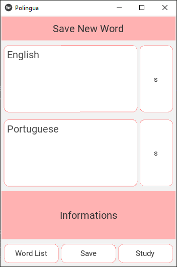

# Polingua

Learn English and Portuguese.

App multiplataforma criado com Python + Kivy.

## Modo de usar

### Instale o Kivy
Pode seguir os passos do tutorial [Usando KivyMD com Python 3.9, Kivy 2.0.0 e a IDE VSCode](https://www.youtube.com/watch?v=Z2PRH_ciLwQ&t=7s) que instala a versão mais recente do Python e o Kivy.


Ou se preferir siga os passos abaixo:


Faça o download do kivy 1.11.1:
```
py -m pip install --upgrade pip wheel setuptools virtualenv

py -m pip install docutils pygments pypiwin32 kivy_deps.sdl2==0.1.* kivy_deps.glew==0.1.*

py -m pip install kivy_deps.gstreamer==0.1.*

py -m pip install kivy_deps.angle==0.1.*

py -m pip install kivy==1.11.1
```

### Baixe o repositório e entre na pasta onde reside o main.py:
``
git clone https://github.com/VictorManhani/polingua.git && cd polingua
``

### Rode o programa:
``
py main.py
``

<p align="left">
  
  
  
</p>